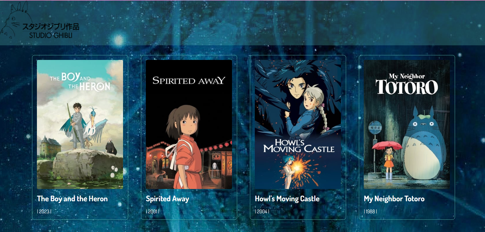

# Movie Challenge

## Índice

- [1. Preâmbulo](#1-preâmbulo)
- [2. Resumo do projeto](#2-resumo-do-projeto)
- [3. Ferramentas utilizadas](#3-ferramentas-utilizadas)
- [4. Funcionalidades](#4-funcionalidades)
- [5. Tarefas](#5-tarefas)
- [6. Critérios ménimos ](#6-critérios-mínimos)
- [7. Considerações finais](#7-considerações-finais)

---

## 1. Preâmbulo

Prepare-se para uma viagem mágica pelo universo do Studio Ghibli, onde cada filme é uma porta para mundos fantásticos e histórias emocionantes!

Se você é um fã de longa data ou está apenas começando a descobrir as maravilhas criadas por Hayao Miyazaki e Isao Takahata, temos o lugar perfeito para você! Aqui, você encontrará um catálogo dos 20 filmes mais populares do Studio Ghibli, que conquistaram corações ao redor do mundo.

Explore os títulos mais amados, desde “Nausicaä do Vale do Vento” até “O Menino e a Garça”, e reviva os momentos mais memoráveis. Cada um desses filmes é uma obra-prima que promete levar você a uma jornada inesquecível através da animação japonesa.

Estamos entusiasmados para compartilhar essa experiência cinematográfica com você! Prepare-se para se encantar com as histórias que definiram gerações e continuam a inspirar sonhadores ao redor do mundo. Seja bem-vindo(a) ao mundo do Studio Ghibli e vamos começar a assistir! 🎬✨

## 2. Resumo do projeto

Bem-vinde ao lançamento do nosso novo site, dedicado aos 20 melhores filmes do Studio Ghibli!

Neste portal, você encontrará uma seleção cuidadosamente curada dos filmes mais encantadores do Studio Ghibli, cada um acompanhado de informações detalhadas e fascinantes.

O principal objetivo deste site é oferecer uma plataforma rica em conteúdo e visualmente atraente, que permita aos visitantes descobrir ou redescobrir as histórias e personagens icônicos que fizeram do Studio Ghibli um fenômeno mundial.

Estamos entusiasmados para guiá-la nesta jornada de descoberta e apreciação cinematográfica! Prepare-se para navegar por resenhas aprofundadas, análises de personagens e curiosidades sobre a produção dessas obras-primas. Explore conosco a magia e a arte do Studio Ghibli. Comece sua exploração agora! 🎬📽️🎞️

## 3. Ferramentas utilizadas

### Preparado do computador

- Node.js
- Git e Gitbash
- Visual Studio Code

### Organização e planejamento

- GitHub
- Notion

### Linguagens

- HTML
- CSS
- Vanilla JavaScript

### Geração de dados

- TMDB

### Prototipagem

- Figma

## 4. Funcionalidades

Segue abaixo os detalhes das funcionalidades mínimas que foram implementadas:

- Navegação Intuitiva: Uma interface amigável e intuitiva, que facilita a exploração do universo do Studio Ghibli.

- Galeria de Imagens: Uma coleção encantadora de imagens dos filmes mais queridos do Studio Ghibli, organizadas para sua apreciação visual.

- Informações Detalhadas: Para cada filme, você pode acessar uma sinopse completa, conhecer os títulos em dois idiomas, e descobrir a data de lançamento, mergulhando ainda mais fundo no mundo mágico de cada história.

## 5. Tarefas

A partir das perguntas e respostas a seguir, foram criadas as histórias de usuários para a execução das tarefas do projeto.

Quem são os principais usuários do produto?

Pessoas que gostam dos filmes do Studio Ghibli.

Quais são os objetivos desses usuários em relação ao produto?

Ter uma lista de indicações de filme.

**História de Usuário: Site dos 20 Melhores Filmes do Studio Ghibli**

**Título: “Encantos do Studio Ghibli”**

**Descrição:**
Como um cinéfilo apaixonado e fã do Studio Ghibli, você está sempre em busca de novas formas de apreciar e explorar as obras-primas desse icônico estúdio de animação japonês. Você descobre que um novo site foi lançado, dedicado a apresentar os 20 melhores filmes do Studio Ghibli, repleto de informações detalhadas, críticas, curiosidades e conteúdos exclusivos. Animado, você decide mergulhar nessa viagem mágica pelo mundo do Studio Ghibli, para redescobrir seus filmes favoritos e aprender mais sobre eles.

**Tarefas:**

1. **Explorar a Lista dos Melhores Filmes:** Como visitante do site, você navega através da lista dos 20 melhores filmes do Studio Ghibli, que inclui títulos como "A Viagem de Chihiro", "Meu Amigo Totoro", "Princesa Mononoke" e muitos outros.
2. **Ler Sinopses e Críticas:** Cada filme possui uma página dedicada com sinopse detalhada, críticas de especialistas e avaliações de outros fãs, ajudando você a entender melhor o contexto e a recepção de cada obra.
3. **Descobrir Curiosidades e Bastidores:** Além das informações básicas, o site oferece curiosidades interessantes, fatos dos bastidores, entrevistas com diretores e animadores, e detalhes sobre a produção de cada filme.
4. **Assistir a Trailers e Clipes Exclusivos:** Você pode assistir a trailers e clipes exclusivos dos filmes, incluindo cenas deletadas e vídeos dos bastidores, proporcionando uma experiência mais rica e imersiva.
5. **Interagir com a Comunidade:** O site permite que você comente nas páginas dos filmes, compartilhe suas próprias críticas e interaja com outros fãs do Studio Ghibli, criando uma comunidade de apreciadores das animações.

**Critérios de Aceitação:**

1. O site deve apresentar uma interface intuitiva e visualmente atraente, refletindo a estética mágica e encantadora dos filmes do Studio Ghibli.
2. As informações sobre os filmes devem ser precisas, completas e bem-organizadas, facilitando a navegação e a leitura.

**Notas Adicionais:**
Este site sobre os 20 melhores filmes do Studio Ghibli é mais do que apenas uma coleção de informações; é um portal mágico para os fãs mergulharem no mundo encantado das animações do Studio Ghibli. Através da combinação de críticas detalhadas, curiosidades fascinantes e conteúdo exclusivo, o site visa proporcionar uma experiência enriquecedora e interativa que aproxime ainda mais os fãs de suas animações favoritas.

## Design de interface de usuário
### Protótipo de baixa fidelidade

#### Protótipo de alta fidelidade

# Divisão de tarefas
## T001

**Desenvolvimento da Página HTML**: Esta fase envolveu uma dedicação meticulosa ao criar a estrutura fundamental do nosso site, que servirá como a espinha dorsal para todas as outras funcionalidades. Investi tempo e esforço para garantir a funcionalidade básica, utilizando técnicas de codificação. No processo, utilizei a API para renderizar um catálogo de filmes, exibindo-o em uma tabela com linhas e colunas. As imagens dos filmes foram geradas automaticamente pela API, assegurando que as informações fossem atualizadas e visualizadas de maneira clara e organizada, estabelecendo a base para futuras melhorias no design e na interatividade do site.

## T002

**Implementação do SPA (Single Page Application)**: Desenvolvi a estrutura do site como uma Single Page Application (SPA), permitindo que o conteúdo fosse carregado dinamicamente sem a necessidade de recarregar a página inteira. Isso proporciona uma experiência de navegação mais fluida e rápida para os usuários. Utilizando JavaScript, organizei as diferentes seções do site para serem exibidas conforme a interação do usuário.

**Desenvolvimento do Botão de Navegação**: Adicionei um botão de navegação interativo, que permite aos usuários alternar entre diferentes seções do site. Este botão, integrado à lógica do SPA, facilita a transição entre a visualização do catálogo de filmes e outras funcionalidades da página. A implementação deste botão garante uma usabilidade aprimorada, tornando a experiência do usuário mais intuitiva e eficiente.

## T003

**Organização do Código para Facilitar Testes**: Estruturei o código de maneira modular, separando as funcionalidades principais em arquivos distintos. Utilizei convenções de nomenclatura claras e comentários explicativos para cada seção do código. Além disso, implementei uma estrutura de pastas lógica e intuitiva, agrupando componentes relacionados, como scripts, estilos e testes, em diretórios apropriados. Essa organização facilita a compreensão do código por outros desenvolvedores e simplifica o processo de criação e execução de testes unitários e de integração, garantindo que o site seja mantido e escalado com eficiência.

## T004

**Funcionalidade Implementada**: A funcionalidade principal implementada foi a visualização dinâmica do catálogo de filmes. Através da API, os dados dos filmes são carregados e exibidos em uma tabela, que inclui colunas para títulos, descrições, classificações e imagens dos filmes. A tabela é atualizada automaticamente, refletindo qualquer alteração nos dados da API. Além disso, cada linha da tabela é interativa, permitindo que os usuários cliquem para obter mais detalhes sobre cada filme. Esta funcionalidade estabelece uma base sólida para futuras melhorias, como a adição de filtros e buscas, melhorando ainda mais a experiência do usuário.

## T005 

**Criação de Testes Unitários**: Desenvolvi uma série de testes unitários para garantir a robustez e a confiabilidade das funcionalidades implementadas. Utilizei frameworks de teste como Jest para JavaScript, permitindo a criação de testes automatizados. Cada módulo e função foi submetido a testes rigorosos, incluindo:

- Teste de Carregamento da API: Verificação se os dados dos filmes são corretamente carregados e exibidos na tabela. Testei diferentes cenários, como respostas bem-sucedidas, erros de rede e dados incompletos.
- Teste de Renderização da Tabela: Certificação de que a tabela é renderizada corretamente com as colunas adequadas e que os dados dos filmes aparecem na ordem correta.
- Teste de Interatividade da Tabela: Validação de que cada linha da tabela é interativa e que, ao clicar, exibe os detalhes corretos do filme selecionado.
- Teste do Botão de Navegação: Verificação da funcionalidade do botão de navegação, assegurando que ele permita a troca entre diferentes seções do site sem recarregar a página.
- Teste de Atualização Dinâmica: Garantia de que a tabela se atualize dinamicamente quando novos dados são recebidos da API, sem necessidade de recarregar a página.

Esses testes unitários foram integrados ao processo de desenvolvimento contínuo, utilizando ferramentas de integração contínua (CI) para executar automaticamente os testes a cada alteração no código. Isso assegura que novas funcionalidades ou mudanças no código não quebrem funcionalidades existentes, mantendo a integridade do site ao longo do tempo.

## T006

**Design Implementado**: Após estabelecer a funcionalidade básica, dediquei-me à implementação do design, assegurando que o site não fosse apenas funcional, mas também visualmente atraente. Utilizei CSS avançado e bibliotecas como Bootstrap para criar um layout responsivo e moderno. As cores, fontes e espaçamentos foram escolhidos cuidadosamente para proporcionar uma experiência de usuário agradável. As imagens dos filmes, geradas pela API, foram estilizadas para se integrarem harmoniosamente ao design geral da tabela, criando uma interface limpa e intuitiva.

## 6. Critérios ménimos 

**Critérios de aceitação mínimos do projeto**

- Definição do produto
- Histórias de usuário
- Desenho da Interface de Usuário
- Protótipo de baixa fidelidade
- Protótipo de alta fidelidade
- Testes de usabilidade
- Implantação de la Interface de Usuário (HTML/CSS/JS)
1. Deve ser utilizado o endpoint /discover/movie.
2. A aplicação deve incluir paginação para explorar o catálogo por páginas.
3. Cada filme deve exibir pelo menos: pôster, título original e ano de lançamento.
4. Deve ser usado o endpoint /movie/{movie_id}.
5. Para o filme, devem ser exibidos pelo menos: pôster, título original, ano de lançamento, gêneros, média de votação e total de votos.
6. A interface deve permitir retornar à lista de filmes, mantendo o filtro e a ordenação.

## 7. Considerações finais

Esta experiência no desenvolvimento do site do Studio Ghibli foi uma jornada solitária, o que proporcionou uma oportunidade única de expandir meu repertório de habilidades, adquirindo novas técnicas e competências fundamentais. A maestria em HTML, CSS e JavaScript foi conquistada por meio de uma meticulosa organização, eficiente gestão do tempo e uma comunicação interna eficaz.

Durante o desenvolvimento deste projeto, aprofundei meu conhecimento em desenvolvimento web, explorando as nuances de cada linguagem e aplicando as melhores práticas em design e usabilidade. A criação de uma estrutura robusta e modular, aliada a um design atraente e responsivo, destacou a importância da atenção aos detalhes e da busca pela excelência em cada etapa do processo.

Embora tenha trabalhado sozinha, busquei feedback externo para validar minhas escolhas de design e funcionalidades, garantindo que o site atendesse às necessidades dos usuários. Essa abordagem colaborativa, mesmo que realizada de forma independente, enriqueceu minha experiência profissional e contribuiu para o sucesso do projeto.

Esta jornada no desenvolvimento do site do Studio Ghibli não apenas consolidou minhas habilidades técnicas, mas também fortaleceu minha confiança na minha capacidade de enfrentar desafios e entregar soluções de alta qualidade. Estou ansiosa para aplicar o que aprendi neste projeto em futuros empreendimentos, continuando a buscar a excelência e a inovação no mundo do desenvolvimento web.
